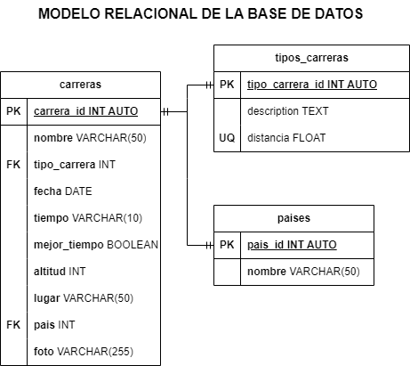

# Carreras

##  Listado de Entidades

### carreras **(ED)**

- carrera_id **(PK)** 
- nombre
- tipo_carrera **(FK)**
- fecha
- tiempo
- mejor_tiempo
- altitud
- foto
- país **(FK)**
- lugar

### Tipos_carreras **(EC)**

 - tipo_carrera **(PK)**
 - nombre
 - distancia

### Paises **(EC)**

- país_id **(PK)**
- nombre

## Relaciones

1. Una **carrera** _pertence_ a un **tipo de carrera** (_1 a M_)
2. Una **carrera** se _corre_ en un **país** (_1 a 1_)

### Modelo Relacional de la BD

## Reglas de Negocio

### carreras

1. Crear el registro una carrera
3. Leer el registro de una(s) carrera(s) dada un condición en particular
4. Leer todos los registros de la entidad carreras
2. Actualizar los datos de una carrera dada una condición en particular
3. Eliminar los datos de una carrera dada una condición en particular

### tipos_carreras

1. Todos los valores del atributo distancia, deberán estar expresados en _km_ y no se podrán repetir
1. Crear el registro una tipo de carrera
3. Leer el registro de uno(s) tipo(s) de carrera(s) dada un condición en particular
4. Leer todos los registros de la entidad tipos carreras
2. Actualizar los datos de un tipo de carrera dada una condición en particular
3. Eliminar los datos de un tipo de carrera dada una condición en particular

### paises

1. Crear el registro una tipo de carrera
3. Leer el registro de uno(s) tipo(s) de carrera(s) dada un condición en particular
4. Leer todos los registros de la entidad tipos carreras
2. Actualizar los datos de un tipo de carrera dada una condición en particular
3. Eliminar los datos de un tipo de carrera dada una condición en particular
