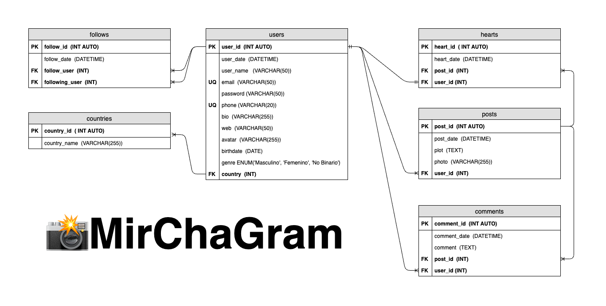

# Instagram 

## Listado de entidades

### posts **(ED)**

- post_id
- post_date
- plot
- photo
- user **(FK)**

### users **(ED)**

- user_id **(PK)**
- user_date
- username
- email **(UQ)**
- password
- telefono **(UG)**
- bio
- web
- avatar
- birthdate 
- genre
- country **(FK)**

### comments **(ED|EP)**

- comment_id **(PK)**
- comment_date
- comment
- post_id **(FK)**
- user **(FK)**

### hearts **(ED|EP)**

- heart_id **(PK)**
- heart_date
- post_id **(FK)**
- user **(FK)**

### follows **()**

- follow_id **(PK)**
- follow_date
- follow_user
- following_user **(FK)**

### countries **(EC)**

- country_id **(PK)**
- country_name

## Relaciones

1. Los **users** publican **posts** (_1 - M_)
1. Los **users** escriben **comments** (_1 - M_)
1. Los **posts** tienen **comments** (_1 - M_)
1. Los **users** otogan **hearts** (_1 - 1_)
1. Los **posts** tienen **follows** (_1 - M_)
1. Los **users** tienen **follows** (_1 - M_)
1. Los **users** siguen **follows** (_1 - M_)
1. Los **users** tienen un **countries** (_1 - M_)

## Diagramas

### Modelo Relacional de la BD

## Reglas de Negocio

### posts

1. Crear un post.
1. Leer todos los posts.
1. Leer un post en particular.
1. Leer los post de un user.
1. Actualizar el plot de un post.
1. Eliminar un post.

### users

1. Crear un user.
1. Leer todos los users.
1. Leer un user en particular.
1. Validar un user.
1. Actualizar datos del user.
1. Actualizar password de user.
1. Eliminar user.

### comments

1. Crear un comment en un post.
1. Leer todos los comments de un post.
1. Leer un comment de un post.
1. Contar el número de comments de un post.
1. Eliminar comment en un post.

### hearts

1. Crear heart de user en un post.
1. Contar el número de hearts de un post.
1. Eliminar heart de user en un post.

### follows

1. Crear follow de un user.
1. Contar el número de followers de un user.
1. Contar el número de followings de un user.
1. Eliminar follow de un user.

### countries

1. Crear country.
1. Leer todos los countries.
1. Leer un country.
1. Actualizar un country.
1. Eliminar country.