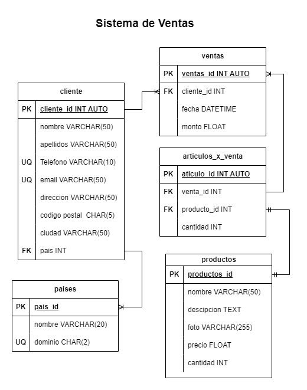

# Ventas

## Listado de Entidades

### clientes **(ED)**

- cliente_id **(PK)**
- nombre
- apellidos
- telefono **(UQ)**
- email **(UQ)**
- direccion
- codigo postal
- ciudad
- pais **(FK)**

### Productos **(ED|EC)**

- producto_id **(PK)**
- nombre
- descripcion
- foto
- precio
- cantidad(stock)

### Ventas **(ED)**

- venta_id **(PK)**
- cliente_id **(FK)**
- fecha
- monto

### articulos_x_venta **(EP)**

- articulo_id **(PK)**
- venta_id **(FK)**
- producto_id **(FK)**
- cantidad

### paises **(EC)**

- pais_id **(PK)**
- nombre
- dominio **(UQ)**

## Relaciones

1. Un **cliente** tiene **país** (_1 - M_)
2. Una **cliente** genera **venta** (_1 - M_)
3. Un **venta** tiene **artículo** (_1 - M_)
4. Un **artículo** es **producto** (_1 - 1_)

## Diagramas

### Modelo Relacional de la BD

## Reglas de Negocio

### clientes

1. Crear cliente
2. Leer todos los clentes
3. Leer un cliente en particular
4. Actualizar cliente
5. Eliminar un cliente

### productos

1. Crear un producto
2. Leer todos los productos
3. Leer un producto en particular
4. Actualizar un producto
5. Eliminar un producto
6. Cada que haya una venta restar a la cantidad de productos disponibles, 
el número de artículos que se vendieron

### ventas

1. Crear una venta 
2. Leer todas las ventas
3. Leer una venta en particular
4. Leer todas las ventas de un cliente
5. Leer todas las ventas de un producto
6. Actualizar una venta
7. Eliminar una venta

### articulos_x_ventas

1. Crear un artículo
2. Leer todos los artículos
3. Leer un artículo en particular
4. Leer todos los artículos de una venta
5. Leer todos los artículos de un producto
6. Leer todos los artículos de un cliente
7. Actualizar un artículo
8. Eliminar un artículo

### paises

1. Crear un pais
2. Leer todos los paises
3. Leer un pais en particular
4. Actualizar un pais
5. Eliminar un pais